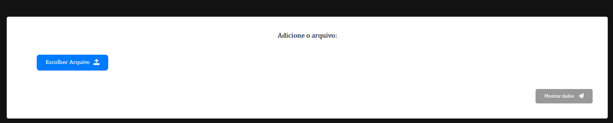
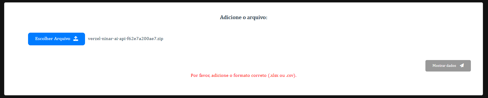
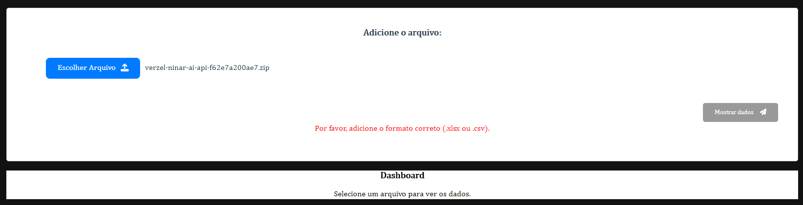
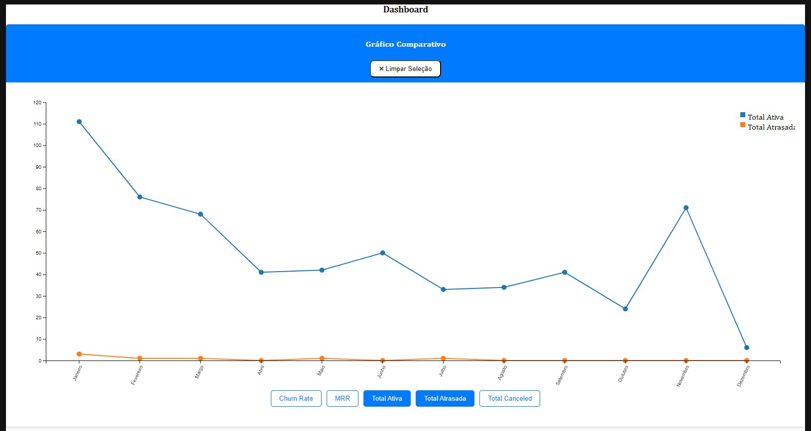
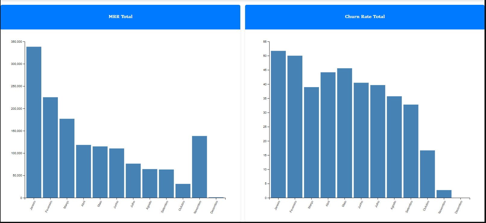
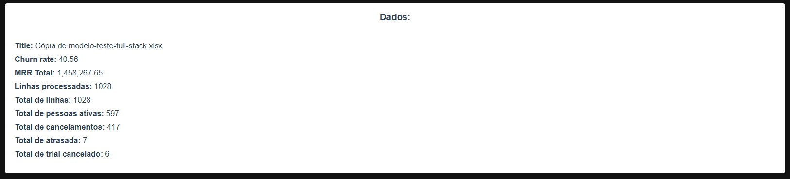

# Upload Project

This project is part of a technical challenge aiming to develop a full-stack web application that allows users to upload a spreadsheet of subscriber data and visualize key business metrics: Monthly Recurring Revenue (MRR) and Churn Rate. Feel free to include additional metrics as it would be a plus.

## Description

The application consists of a front-end interface and a back-end server. The front-end allows users to upload spreadsheet files in either .xlsx or .csv format. Upon receiving data from the backend, interactive charts are displayed, showing month-to-month metrics.

## Technologies Used

- **Front-End**: Vue.js
- **Back-End**: [To be specified]

## Project Setup

To set up and run the project, follow these steps:

### Installation

### Customize configuration

See [Vue CLI Configuration Reference](https://cli.vuejs.org/config/).

## Usage

1. Clone the repository.
2. Install dependencies using `npm install`.,
3. If the above commando doesn't work, try using `npm install --legacy-peer-deps`.
4. Run the development server with `npm run serve`.
5. Access the application in your browser at the specified address.

## Additional Information

- This project is a solution to a technical challenge.
- The backend server's technology is not specified and needs to be implemented.
- Feel free to customize and extend the project as needed.

## Author

Adísio Fialho Júnior

## License

This project is licensed under the [MIT License](LICENSE).

## Frontend: Visualização e Funcionalidades

A seguir, apresento o layout do frontend, acompanhado de algumas imagens:

### Input de Arquivo:

- **Input de Arquivo:** Atente para o botão "Mostrar Dados", que está desabilitado e só se torna ativo quando um arquivo é carregado.

- **Input de Arquivo:** Se o tipo de arquivo selecionado for diferente dos formatos aceitos, uma mensagem de erro é exibida e o botão fica desabilitado.

- **Input de Arquivo:** Se o tipo de arquivo selecionado for correto, o botão vai ser ativado.

- **Input de Arquivo:** Se não tiver um arquivo selecionado, ou estiver com um arquivo de erro, o mesmo vai mostrar um mensagem para selecionar um arquivo para visualizar os dados. .

### Primeiro Card:

- **Gráficos Dinâmicos:** Possibilitam a seleção de até dois valores para comparação. O botão "Limpar Seleção" permite a escolha de novas variáveis para comparação.

- **Gráficos de MRR Total e Churn Rate Total:** São exibidos para cada mês.

### Segundo Card:

- **Dados:** Incluem o título do arquivo, a taxa total, o MRR total, o número de linhas processadas, o total de linhas da planilha, o total de pessoas ativas, o total de cancelamentos, o total de atrasos e o total de cancelamentos de teste.

Este é o layout e as funcionalidades oferecidas pelo frontend do aplicativo.

## Deploy
- **Frontend:** https://upload-project.vercel.app/
- **Backend:** https://subscription-analytics-project.vercel.app/api/upload/